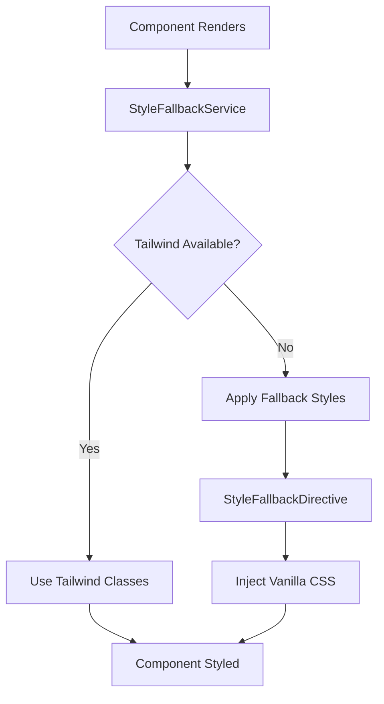

# Style Integration Guide

This guide explains how the shared library handles CSS styling with Tailwind CSS integration and fallback mechanisms.

## Overview

The shared library provides a robust styling system that works with or without Tailwind CSS. It includes:

- **Style Detection**: Automatically detects if Tailwind CSS is available
- **Fallback System**: Provides vanilla CSS fallbacks when Tailwind is not available
- **Dynamic Application**: Applies appropriate styles based on the environment
- **SSR Support**: Works correctly in server-side rendering environments

## Architecture

### Core Components

1. **StyleFallbackService**: Manages style detection and fallback activation
2. **StyleFallbackDirective**: Applies fallback styles to individual elements
3. **Style Detection Utilities**: Functions for detecting CSS capabilities
4. **Enhanced Components**: Library components with built-in fallback support

### How It Works



## Usage

### Basic Usage

The style fallback system works automatically. Simply use library components:

```typescript
import { LoadingComponent } from 'shared-lib';

@Component({
  template: `
    <lib-loading type="spinner" size="lg" message="Loading..."></lib-loading>
  `
})
export class MyComponent {}
```

### Manual Style Fallbacks

Use the `StyleFallbackDirective` for custom components:

```typescript
import { StyleFallbackDirective } from 'shared-lib';

@Component({
  template: `
    <div 
      [libStyleFallback]="fallbackStyles"
      [fallbackClasses]="['lib-flex', 'lib-items-center']"
      [criticalStyles]="true">
      Custom content
    </div>
  `,
  imports: [StyleFallbackDirective]
})
export class CustomComponent {
  fallbackStyles = {
    'display': 'flex',
    'align-items': 'center',
    'padding': '1rem',
    '--primary-color': '#3b82f6'
  };
}
```

### Service Integration

Access the style fallback service directly:

```typescript
import { StyleFallbackService } from 'shared-lib';

@Component({...})
export class MyComponent {
  constructor(private styleFallbackService: StyleFallbackService) {}

  ngOnInit() {
    // Check if Tailwind is loaded
    const isLoaded = this.styleFallbackService.isStylesLoaded();
    
    // Force re-detection
    this.styleFallbackService.forceDetection();
    
    // Update configuration
    this.styleFallbackService.updateConfig({
      enableFallbacks: true,
      fallbackStyles: {
        '.my-class': 'color: red;'
      }
    });
  }
}
```

## Configuration

### Default Configuration

The system comes with sensible defaults:

```typescript
const DEFAULT_FALLBACK_STYLES = {
  enableFallbacks: true,
  fallbackStyles: {
    '.lib-flex': 'display: flex;',
    '.lib-flex-col': 'flex-direction: column;',
    '.lib-items-center': 'align-items: center;',
    '.lib-justify-center': 'justify-content: center;',
    '.lib-animate-spin': 'animation: lib-spin 1s linear infinite;',
    // ... more styles
  },
  criticalClasses: [
    'lib-flex',
    'lib-items-center',
    'lib-animate-spin'
  ]
};
```

### Custom Configuration

Override defaults in your application:

```typescript
import { StyleFallbackService } from 'shared-lib';

@Injectable()
export class AppConfigService {
  constructor(private styleFallbackService: StyleFallbackService) {
    this.styleFallbackService.updateConfig({
      enableFallbacks: true,
      fallbackStyles: {
        '.my-custom-class': 'background: linear-gradient(45deg, #ff6b6b, #4ecdc4);',
        '.my-animation': 'animation: myCustomAnimation 2s ease-in-out infinite;'
      }
    });
  }
}
```

## Components

### Loading Component

The loading component supports multiple types with automatic fallbacks:

```typescript
// Spinner (default)
<lib-loading type="spinner" size="md"></lib-loading>

// Skeleton loader
<lib-loading 
  type="skeleton" 
  [lines]="3" 
  [showAvatar]="true">
</lib-loading>

// Animated dots
<lib-loading type="dots" size="lg"></lib-loading>

// Pulse animation
<lib-loading 
  type="pulse" 
  message="Please wait...">
</lib-loading>
```

#### Sizes

- `sm`: Small size (1rem)
- `md`: Medium size (2rem) - default
- `lg`: Large size (3rem)

#### Fallback Behavior

When Tailwind is not available:
- Spinner uses vanilla CSS borders and animations
- Skeleton uses background colors and pulse animations
- Dots use background colors and bounce animations
- All animations use CSS keyframes

### Style Fallback Directive

Apply fallback styles to any element:

```typescript
// String styles
<div libStyleFallback="color: red; font-size: 16px;">Content</div>

// Object styles
<div [libStyleFallback]="{ 'color': 'blue', 'font-weight': 'bold' }">Content</div>

// With classes
<div 
  [libStyleFallback]="styles"
  [fallbackClasses]="['lib-flex', 'lib-items-center']"
  [criticalStyles]="true">
  Content
</div>

// Force apply (ignore detection)
<div 
  [libStyleFallback]="styles"
  [forceApply]="true">
  Content
</div>
```

## CSS Custom Properties

The system uses CSS custom properties for theming:

```css
:root {
  --loading-primary-color: #3b82f6;
  --loading-secondary-color: #e5e7eb;
  --loading-text-color: #4b5563;
}
```

Override in your application:

```css
.my-theme {
  --loading-primary-color: #10b981;
  --loading-secondary-color: #f3f4f6;
}
```

## Animations

### Built-in Animations

The system includes fallback keyframes:

```css
@keyframes lib-spin {
  from { transform: rotate(0deg); }
  to { transform: rotate(360deg); }
}

@keyframes lib-pulse {
  0%, 100% { opacity: 1; }
  50% { opacity: 0.5; }
}

@keyframes lib-bounce {
  0%, 100% { transform: translateY(-25%); }
  50% { transform: none; }
}
```

### Custom Animations

Add your own animations:

```typescript
this.styleFallbackService.updateConfig({
  fallbackStyles: {
    '.my-animation': 'animation: myCustomAnimation 2s ease-in-out infinite;'
  }
});
```

```css
@keyframes myCustomAnimation {
  0% { transform: scale(1); }
  50% { transform: scale(1.1); }
  100% { transform: scale(1); }
}
```

## SSR Support

The system is fully compatible with server-side rendering:

```typescript
// Automatically detects SSR environment
if (typeof window === 'undefined') {
  // SSR mode - applies fallbacks by default
  return { fallbackRequired: true };
}
```

## Performance

### Bundle Size Impact

- Core system: ~15KB gzipped
- Fallback styles: ~5KB gzipped
- Total overhead: ~20KB gzipped

### Optimization Tips

1. **Selective Imports**: Import only what you need
2. **Tree Shaking**: Use named imports for better tree shaking
3. **Lazy Loading**: Load fallback styles only when needed
4. **Caching**: Detection results are cached automatically

## Troubleshooting

### Common Issues

#### Styles Not Applied

```typescript
// Check if service is ready
if (!this.styleFallbackService.isReady()) {
  this.styleFallbackService.forceDetection();
}
```

#### Fallbacks Not Working

```typescript
// Verify configuration
const config = this.styleFallbackService.config();
console.log('Fallbacks enabled:', config.enableFallbacks);
```

#### Animation Issues

```typescript
// Check animation support
const result = this.styleFallbackService.getDetectionResult();
console.log('Animations supported:', result?.animationsSupported);
```

### Debug Mode

Enable debug logging:

```typescript
// In development
if (!environment.production) {
  this.styleFallbackService.updateConfig({
    enableFallbacks: true,
    debugMode: true // Custom property for debugging
  });
}
```

## Migration Guide

### From Previous Versions

If upgrading from a version without style fallbacks:

1. **Update Imports**: Add new imports for fallback components
2. **Review Templates**: Update templates to use new directive syntax
3. **Test Fallbacks**: Test your application without Tailwind CSS
4. **Update Styles**: Migrate custom styles to use CSS custom properties

### Breaking Changes

- `LoadingComponent` now requires `StyleFallbackDirective` import
- Some CSS classes have been renamed with `lib-` prefix
- Custom animations should use the new keyframe format

## Best Practices

### 1. Use Semantic CSS Classes

```typescript
// Good
fallbackStyles = {
  '.loading-container': 'display: flex; align-items: center;',
  '.loading-spinner': 'animation: lib-spin 1s linear infinite;'
};

// Avoid
fallbackStyles = {
  '.div1': 'display: flex;',
  '.span2': 'color: red;'
};
```

### 2. Leverage CSS Custom Properties

```typescript
// Good - themeable
fallbackStyles = {
  '.my-component': 'color: var(--primary-color, #3b82f6);'
};

// Avoid - hardcoded
fallbackStyles = {
  '.my-component': 'color: #3b82f6;'
};
```

### 3. Test Without Tailwind

Always test your application with Tailwind CSS disabled:

```typescript
// Temporarily disable Tailwind detection for testing
this.styleFallbackService.updateConfig({
  enableFallbacks: true
});
```

### 4. Progressive Enhancement

Design for fallbacks first, enhance with Tailwind:

```typescript
// Base styles that work everywhere
fallbackStyles = {
  '.button': 'padding: 0.5rem 1rem; border: 1px solid #ccc; border-radius: 0.25rem;'
};

// Enhanced with Tailwind classes
<button class="bg-blue-500 hover:bg-blue-600 text-white font-bold py-2 px-4 rounded">
  Click me
</button>
```

## API Reference

### StyleFallbackService

#### Properties

- `state: Signal<StyleFallbackState>` - Current service state
- `config: Signal<StyleFallbackConfig>` - Current configuration
- `isStylesLoaded: Signal<boolean>` - Whether styles are loaded
- `needsFallback: Signal<boolean>` - Whether fallbacks are needed
- `isReady: Signal<boolean>` - Whether service is initialized

#### Methods

- `updateConfig(config: Partial<StyleFallbackConfig>): void`
- `forceDetection(): void`
- `getDetectionResult(): StyleDetectionResult | null`
- `isFeatureSupported(feature: keyof StyleDetectionResult): boolean`

### StyleFallbackDirective

#### Inputs

- `libStyleFallback: FallbackStyleMap | string` - Fallback styles
- `fallbackClasses: string[]` - CSS classes to apply
- `criticalStyles: boolean` - Whether styles are critical
- `forceApply: boolean` - Force apply regardless of detection

### Utility Functions

- `detectTailwindLoading(): boolean`
- `detectAnimationSupport(): boolean`
- `detectCustomPropertiesSupport(): boolean`
- `detectStyleCapabilities(): StyleDetectionResult`
- `createFallbackStyles(config: StyleFallbackConfig): string`
- `applyFallbackStyles(css: string, id?: string): void`
- `removeFallbackStyles(id?: string): void`

## Examples

See the [examples directory](./examples/) for complete working examples:

- [Basic Usage](./examples/basic-usage/)
- [Custom Fallbacks](./examples/custom-fallbacks/)
- [SSR Integration](./examples/ssr-integration/)
- [Performance Optimization](./examples/performance/)

## Contributing

When contributing to the style system:

1. **Add Tests**: Include unit tests for new functionality
2. **Update Documentation**: Keep this guide up to date
3. **Test Fallbacks**: Ensure fallbacks work without Tailwind
4. **Performance**: Consider bundle size impact
5. **Accessibility**: Ensure styles meet accessibility standards

## License

This style integration system is part of the shared library and follows the same license terms.